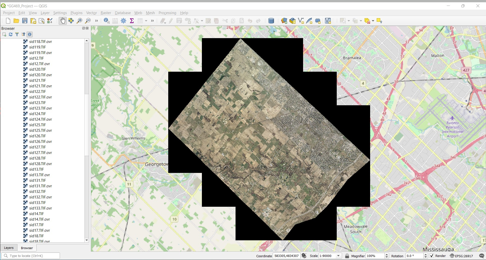
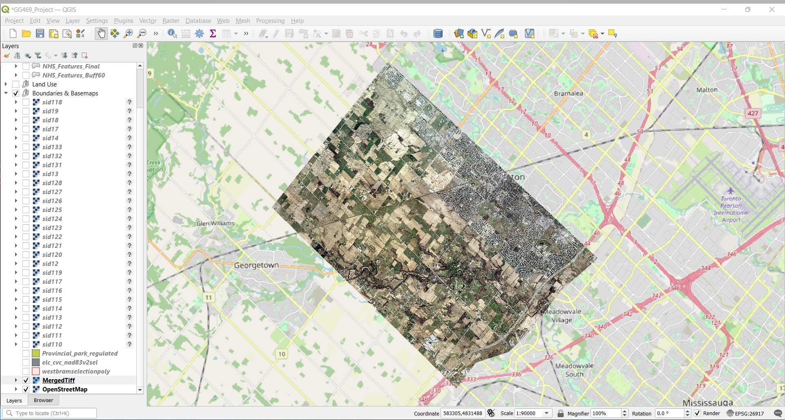

# GG 469 Wint 2022 - Project Outline

Create a design for a Natural Heritage System (Greenlands System) for the City of Brampton, Ontario. Work primarly within the study area but consider adjacent areas and there effect on your design.  Use, Forman, R.T.T. Some general principles of landscape and regional ecology. Landscape Ecol 10, 133–142 (1995) as a primary source to understand the basic tenants of a good natural heritage system design.

## Part I: Analysis

### Specific Tasks:

1. Designate Core areas
2. Designate Existing Corridor connections
3. Designate Potential Corridors
4. Plot your design indicating existing land use and the three components of the Natural Heritage system: Core areas, Existing Corridors, and Potential Corridors

## Part II: Dissemination

Create a web map application using R/RStudio/leaflet to communicate your system design.

### Specific Tasks:

1. Write fully commented R code to create a new leaflet map widget and add the elements of your Natural Heritage System components as shapefiles to the map widget.
2. Use addTiles() to add a background map to the map widget. (see the provided text file "leafletshapeex.txt" to see an example of adding shapefiles to a leaflet map widget)

## GIS Processes

**Data Acquisition and Analysis** - Reviewing all provided data and its Metadata, and selecting additional, external data sets based on our discussions of project scope. 

**Creation of Study Area** - Course provided data included a file of 28 separate .TIF Landsat imagery files, each a square with an edge length of 2.5km and an area of 6.25km². When all layers were projected they form a square with an area of approx. 175km², however each of the external images had a black "border". Boarder was removed by adding "0" to the No Data Value property for the layer, which is remove some pixels from withing the map that had a value of "0", however it seamed a suitable workaround that did not ultimately affect the outcome of the map. (See Before and after pictures)

**Separation of Land-use Features** - The primary layer used in this project was "elc_cvc_nad83v2sel", mapping the Ecological Land Classification (ELC) of our study area, preformed by Credit Valley Conservation (CVC). Using the Split Vector Layer tool, selecting for 'TYPE' we were able to create 

## Difficulties

- Collaborations, No effective Multi-User GIS software, 
- Data Sources, Variations in source data availability,
    - Only Raster Imagery Available was Provided .TIF from 1996, original plan was to get addition imagery for modern date to provide comparison. 
- Automation/ Mechanization of organization of a organic/ Natural feature structure
- 
WGS 84 - EPSG:4326
